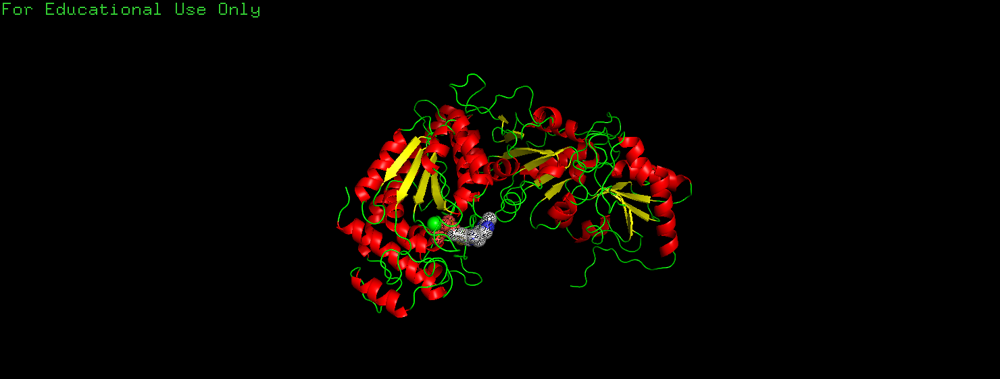
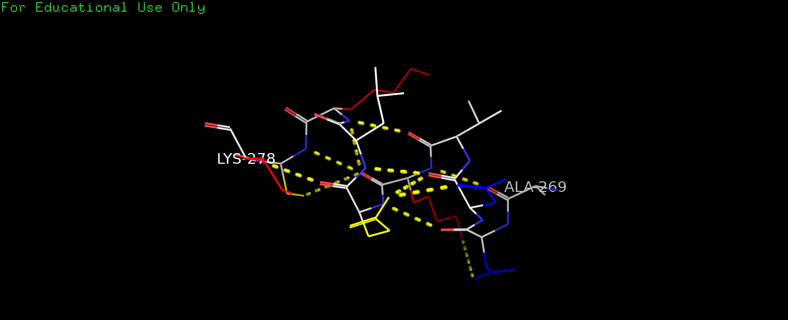
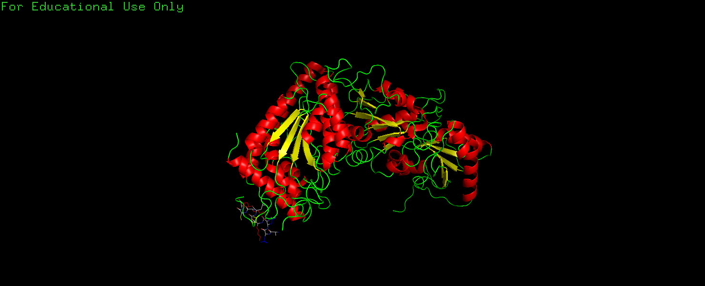

Description for 1TRK Transketolase Protein

James Qian

<jnqian@sfu.ca>

The 1TRK Transketolase under investigation in this paper is obtained
from Saccharomyces cerevisiae at 2.0 A resolution. Transketolase is an
enzyme that plays a key role in the pentose phosphate pathway, which is
a metabolic pathway that occurs in the cytoplasm of cells. It catalyzes
the transfer of a two-carbon unit from a ketose sugar to an aldose sugar
to form a new ketose sugar and a different aldose. This reaction is
important for the interconversion of various sugars and for the
production of pentose sugars that are used in nucleotide biosynthesis.
The hetero group in transketolase is thiamine pyrophosphate (TPP). TPP
is a coenzyme that is derived from vitamin B1 and is essential for the
activity of transketolase. The TPP molecule acts by stabilizing the
transition states of the reaction and by donating and accepting
two-carbon units during the transfer reactions.

The 1TRK Transketolase is a homodimer with 678 amino acid residues in
each of the two chains. Each chain contains 23 alpha-helices which
encompass 272 amino acid residues, 16 beta-sheets which encompass 77
amino acid residues and 38 loops which encompass 329 amino acid
residues. The following 3-D views generated by PyMol2 help to illustrate
the structures and features of 1TRK Transketolase.

View 1. Cartoon illustration for one chain of 1TRK Transketolase with
the dotted van der Waals interactions shown on a ligand (TPP) generated
by PyMol2. The alpha helices are shown in red, the beta sheets are shown
in yellow, and the loops are shown in green.

View 2. Line illustration of one alpha helix from 1TRK Transketolase
along with its side groups generated by PyMol2. The side chains are
colored by type (polar: yellow, nonpolar: white, positive: red,
negative: blue). The polar (yellow) side chains point to the bottom
while the nonpolar (white) side chains point to the top.

View 3. Line illustration for the same alpha helix as in View 2 along
with the cartoon illustration for the rest of the structures in one
chain of 1TRK Transketolase generated by PyMol2. It can be seen that
this alpha helix is on the surface of the protein so its polar side
chains are mostly facing outward toward the solvent while its nonpolar
side chains are on the side facing the interior of the protein.

Reference

Summary Information, [*https://www.rcsb.org/structure/1TRK*](https://www.rcsb.org/structure/1TRK), Protein Data Bank

Nikkola M, Lindqvist Y, Schneider G. *Refined structure of transketolase
from Saccharomyces cerevisiae at 2.0 A resolution.* Journal of Molecular
Biology. 1994 May;238(3):387-404. DOI: 10.1006/jmbi.1994.1299. PMID:
8176731.

The PyMOL Molecular Graphics System, Version 2.0 Schrödinger, LLC.
